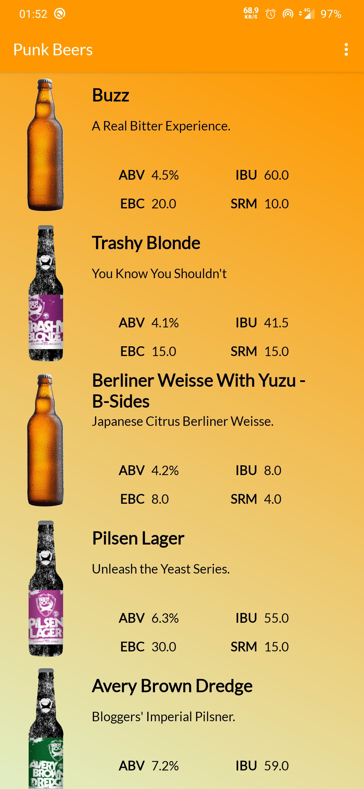
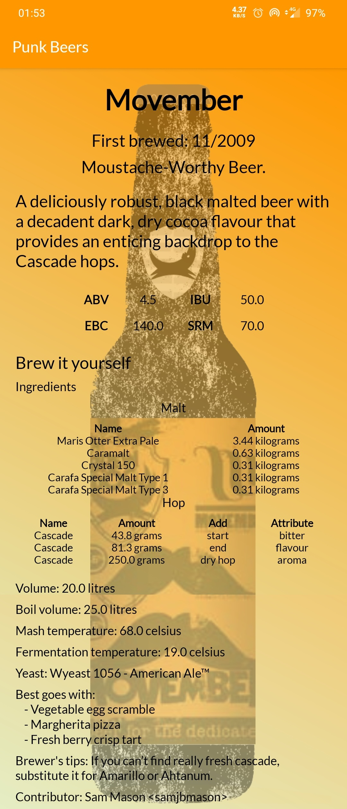

# punkbeers


## Présentation
Développement d'une application Android en Java for Android.

L'application est un répertoire de recettes de bières.

## Prérequis
* Android Studio
* Java 8 (ou plus récent)

## Installation
* Importer le projet sur Android Studio depuis GitHub :
```
https://github.com/ocruze/punkbeers.git
```
* Se prendre un café ☕ pendant que Gradle s'occupe de la compilation

## Consignes respectées
* Clean Architecture & MVC
* Appels REST
* Ecrans :
    * Ecran principal affichant la liste de bières
    * Ecran détail affichant le détail d'une bière
* Gitflow
* Intégration continue

## Fonctionnalités

### Ecran principal



### Ecran de détail de la bière



# Source de données

API utilisée par cette appli : [PunkApi](https://punkapi.com/)
```
https://github.com/samjbmason/punkapi
```
