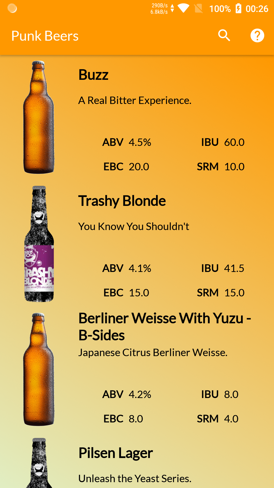
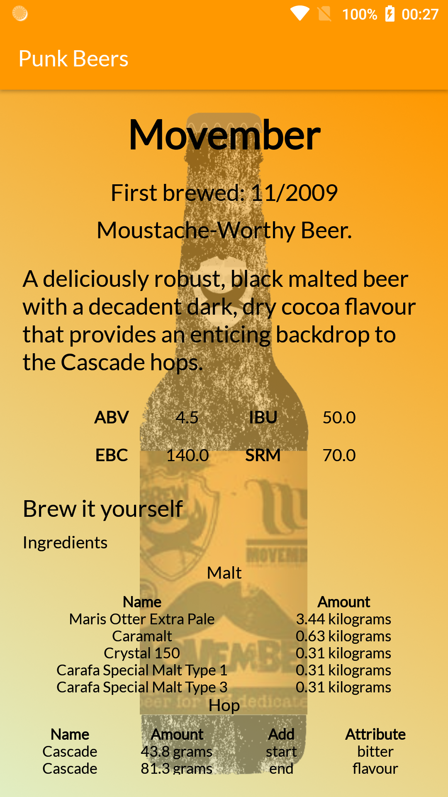
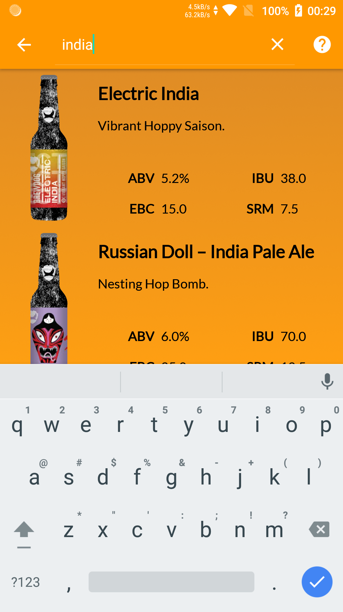
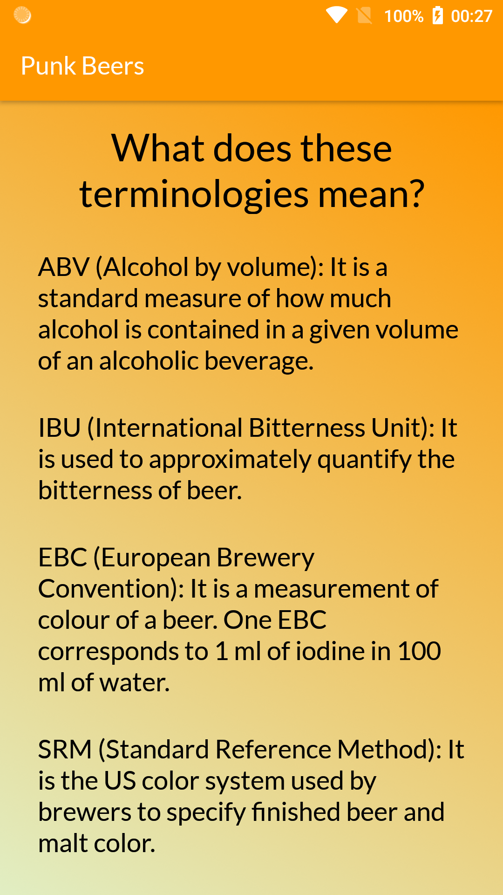

# punkbeers 🍺


## Présentation
Développement d'une application Android en Java for Android.

Cette application est un recueil de recettes de bières.

## Prérequis
* Android Studio
* Java 8 (ou plus récent)

## Installation
* Importer le projet sur Android Studio depuis GitHub :
```
https://github.com/ocruze/punkbeers.git
```
* Se prendre un café ☕ pendant que Gradle s'occupe de la compilation

## Consignes respectées
* Clean Architecture & MVC
* Appels REST
* Ecrans :
    * Ecran principal affichant la liste de bières
    * Ecran détail affichant le détail d'une bière
* Gitflow
* Intégration continue
* Fonctionnalités supplémentaires :
    * Ecran aide avec l'explication de quelques termes techniques
    * Chargement dynamique des éléments de la liste
    * Barre de recherche
    * Fond d'écran animé
    * Icône de lanceur
    * Ecran splash

## Fonctionnalités

### Icône de lanceur


### Ecran splash

Cet écran est affiché pendant que l'application se charge.


### Ecran principal

Cet écran affiche la liste des bières, soit en faisait appel à l'API si le téléphone est connecté à internet, soit depuis le stockage cache s'il y en a.

Les éléments de la liste sont chargés au fur et à mesure. L'API ne fournit pas d'image pour certaines bières, auquel cas une image par défaut est affichée.



### Ecran de détail de la bière

Quand on clique sur un élément de la liste, en l'occurence une bière, l'application nous mène vers un autre écran qui affiche plus de détail comme son origine et sa liste d'ingrédients.



### Ecran recherche

L'écran principal propose de rechercher une bière par son nom. Il suffit juste de cliquer sur le bouton rechercher sur la barre d'outils affichée en haut de l'écran et y taper le nom de la bière. Une connexion à internet est nécessaire pour cette fonctionnalité bien évidemment.



### Ecran aide

Toujours depuis l'écran principal, nous avons la possibilité d'afficher une page aide en cliquant sur le bouton aide. Nous pouvons trouver des définitions des termes techniques du monde de la bière. Bien sûr si vous êtes un amateur de bières, cette fonctionnalité vous est d'aucune utilité.



## Développeur
Orka `Arnest` CRUZE,

o.cruze@live.com

cruze@et.esiea.fr

3A-UFA-Paris, ESIEA.

## Source de données

API utilisée par cette appli : [PunkApi](https://punkapi.com/)
```
https://github.com/samjbmason/punkapi
```
